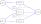
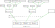
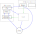

# Winding Tree Platform for Airlines - Proof of Concept proposal

In this document, we would like to present a proposal for
generalization of the Winding Tree platform so that it can
accommodate not just hotels but also airlines.

## Overview

The proposed solution is supposed to be a simple proof of
concept; a functional stepping stone that can be created with
minimal effort, but one that can be significantly extended in
the future.

With this in mind, we have decided to utilize as much from our
existing hotel infrastructure as possible, making working with
airlines very similar to working with hotels.

## Architecture

Just like in case of hotels, we envision the airline platform having
the following components:

- *WT Airline Index* - an Ethereum smart contract covering all the
airlines in the platform; equivalent to WT Hotel Index.
Individual airlines would then be represented by individual
Airline smart contracts reachable from the index, again,
similarly to the case of hotels. All other data would be
available off-chain based on references from the airline smart
contracts.

- *Decentralized off-chain storage* - Actual airline data should
be available off-chain in a decentralized manner, using
pre-agreed standard mechanisms, such as HTTP, Swarm or even NDC.

- *Convenience tools* - To make the platform usable, we would
like to extend support of the existing tools for airlines. This
includes at least:

    - wt-js-libs
    - wt-read-api
    - wt-notification-api
    - wt-booking-api

The architecture can be illustrated from various viewpoints
using the following informal diagrams.

### Overview

In the first picture, the general overview is shown. Blue arrows
denote data flow; green arrows denote references (the same holds
in consequent diagrams as well). It shows that data suppliers
would push data in two principal ways - to the Ethereum
blockchain (i.e., register the airline on the WT airline index)
and to off-chain storages (more about them later). Data
consumers would then read from both.

### Data structure

The second picture shows how the data structure itself is
composed in terms of documents. We can see that the on-chain
storage only holds a reference to the data root document, which
in turn holds references to other sub-documents.

### Example integration

Finally, we can have a look at an example of how the actual
integration can be done in practical terms:

1. A once-off script is used to create an entry in the WT
   airline index and upload the root data document to swarm, as
   well as any static data.

2. Dynamic data, such as current flight availability
   information, is served dynamically by an API that conforms
   to the WT data structure. This API will probably be
   integrated with some internal systems of the airline in
   question.

3. A potential data consumer discovers the airline data
    root on the WT Airline index. All the actual
    information can then be retrieved by following the
    references.

### Booking

Initially, booking will work just like it does in case of
hotels:

- The airline provides a booking service conforming to the agreed
interface.
- The airline data root points to the service address.
- Consumers can send their booking requests there.

## Data structure

The data structure is formally described [here](attachments/airlines-data-swagger.yaml),
using the OpenAPI notation.

## Implementation details

### WT Read API

In case of [wt-read-api](https://github.com/windingtree/wt-read-api)
we will simply add new endpoints handling airlines, next to the
existing endpoints for hotels.

### WT Notification API

[wt-notification-api](https://github.com/windingtree/wt-notification-api)

Update scopes need to be extended in the update notification
data structure, nothing more.

### WT Booking API

[wt-booking-api](https://github.com/windingtree/wt-booking-api)

We need to define the booking interface and provide a reference
implementation in the form of a dedicated endpoint in the
wt-booking-api repository.

### NDC Compatibility

From the point of view of the WT Platform, [NDC](https://www.iata.org/whatwedo/airline-distribution/ndc/Pages/default.aspx)-compatible
APIs can be viewed as off-chain storages to read from (and
possibly even to write to). Therefore, we will probably develop
an NDC off-chain adapter, similar to (if somewhat more complex
than) the existing swarm and http adapters. To this end, we
might base the work on the [NDC adapter](https://github.com/afklblockchain)
developed by the AFKL team in the WindingTree hackathon.
